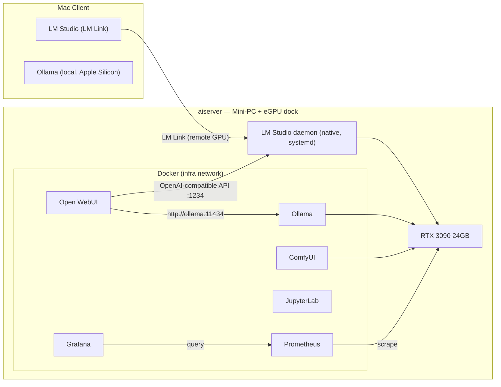

# Homelab AI Stack

A self-hosted, GPU-accelerated local LLM inference stack: a headless mini-PC with an eGPU-docked RTX 3090 serves models to a Mac client over the LAN, with live terminal dashboards and load-testing loops for GPU/VRAM and token-throughput monitoring.

No cloud inference. Everything — chat, coding assistance, image generation, notebooks, RAG — runs on local hardware.

---

## Architecture

The Mac is a daily-driver client only — no monitor/keyboard/mouse on the server. All management is via SSH; all UI is via browser over the LAN.

## Hardware

| Component | aiserver | Mac client |
|---|---|---|
| CPU | AMD Ryzen 7 8845HS (8C/16T) | Apple Silicon (M-series) |
| RAM | 96 GB DDR5 | 32 GB unified |
| GPU | MSI RTX 3090 24 GB, via eGPU dock (OCuLink, 64 Gbps) | — (offloads to aiserver via LM Link) |
| Storage | 4 TB NVMe | — |
| PSU (GPU) | Corsair SF850 (850W SFX) | — |
| UPS | 1500VA/1000W pure sine wave | — |

## Software Stack

| Service | Role | Deployment |
|---|---|---|
| Ollama | Local LLM inference (chat, embeddings) | Docker |
| Open WebUI | Chat UI — model selector across Ollama + LM Studio | Docker |
| LM Studio + LM Link | OpenAI-compatible API; remote-GPU compute offload for the Mac client | Native (systemd) |
| ComfyUI | Image generation (SDXL / Flux) | Docker |
| JupyterLab | GPU-backed PyTorch notebooks, RAG experiments | Docker |
| Prometheus + Grafana | Persistent GPU/host metrics | Docker |
| Netdata | Real-time system dashboard | Docker |

Every service runs bind-mounted under `/opt/docker/<service>/` so container updates never touch model weights or app data. See [`docs/architecture.md`](docs/architecture.md) for the full design rationale (storage rule, what goes on the host vs. in Docker, deployment phasing).

## Monitoring & Load-Testing

The interesting part: rather than only reading `nvidia-smi` output, this stack pairs live dashboards with small loops that continuously exercise the loaded model and record throughput — so the dashboard always has a real, current tok/s figure instead of a one-off benchmark.

| Script | What it does |
|---|---|
| [`monitoring/ai-stats.sh`](monitoring/ai-stats.sh) | Single-screen terminal dashboard on the server: GPU util/VRAM/temp/power bars, per-process VRAM breakdown, last-inference tok/s per engine, CPU/RAM, Docker container stats |
| [`monitoring/mac-stats.sh`](monitoring/mac-stats.sh) | Equivalent dashboard for the Mac client, using `powermetrics` for GPU/CPU/RAM instead of `nvidia-smi` |
| [`monitoring/ollama-inference-loop.sh`](monitoring/ollama-inference-loop.sh) | Repeatedly prompts the local Ollama model, computes tok/s from the API's own timing fields, writes the result for the dashboard to pick up |
| [`monitoring/lmstudio-inference-loop.sh`](monitoring/lmstudio-inference-loop.sh) | Same idea against the LM Studio OpenAI-compatible API |
| [`monitoring/lms-benchmark-loop.py`](monitoring/lms-benchmark-loop.py) | Python variant: drives `lms chat` directly in a loop against whatever model is currently loaded, parses `--stats` output, shows a live spinner |
| [`monitoring/lms-stats-stream.sh`](monitoring/lms-stats-stream.sh) | Alternative to the loop above — taps LM Studio's own `lms log stream --stats` event feed instead of polling |

Run a dashboard (`ai-stats.sh` or `mac-stats.sh`) in one terminal and an inference loop in another; the dashboard's "Last Inference" row updates every cycle. See [`docs/inference-runbook.md`](docs/inference-runbook.md) for the full command reference (model management, VRAM budgeting across concurrent workloads, Grafana dashboard notes).

## Docs

- [`docs/architecture.md`](docs/architecture.md) — design principles, storage convention, deployment phasing
- [`docs/setup-runbook.md`](docs/setup-runbook.md) — full stack setup: drivers, Docker service layout, ports/firewall, monitoring stack
- [`docs/inference-runbook.md`](docs/inference-runbook.md) — day-to-day operation: running models, API usage, VRAM budgeting, monitoring

## Notes

- IPs/hostnames in the docs and scripts are placeholders (`aiserver.lan`, env vars) — this is a portfolio writeup of a real personal homelab build, not a deployable template for someone else's network.
- No secrets, credentials, or real network details are included.

## License

MIT — see [LICENSE](LICENSE).
